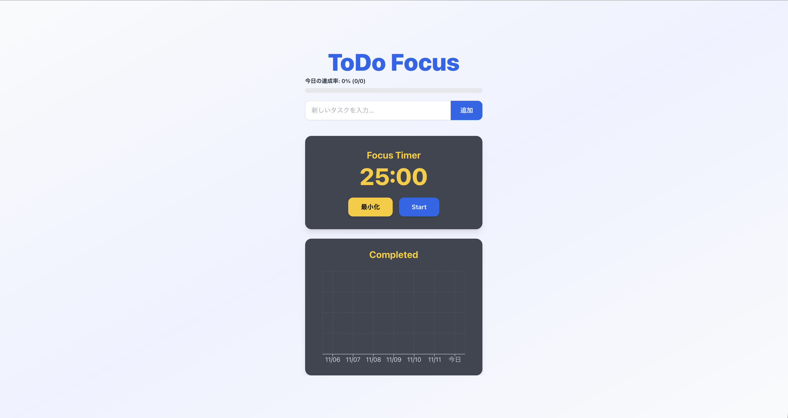

# ToDo Focus

毎日集中してやることをこなすための、集中時間付きのタスクアプリです。

## 公開URL

https://todo-focus-frontend.onrender.com

## アプリ概要

- シンプルなUIでタスクを追加、完了、削除
- 集中時間（25分）、休憩（5分）でタイマーを表示
- タイマーはPiP（ピクチャーインピクチャー）で画面の幅を取らない
- 時間の切り替えごとに通知で教えてくれる
- 1日ごとの完了数を合計して表示
- Flask API　+ React　フロントをRnder上で公開
- ユーザごとに独立しており、SQLiteによりデータを保存

## 使用技術

### フロントエンド

- React(Vite/CRA) + Tailwind CSS
- fetchによるAPI通信
- localStorageでユーザ識別
- Rechartsによる統計グラフ描画

### バックエンド

- Flask(Python)
- SQLAlchemy + SQLite
- CORS対応

## 使用デモ画面

